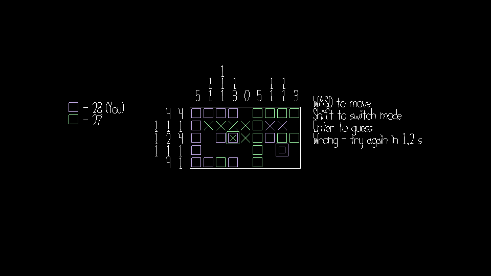

# Open Nonogram

Author: Yoseph Mak

Design: This is a [nonogram](https://en.wikipedia.org/wiki/Nonogram) puzzle game where multiple people work together to complete the grid.

Networking: The client/server multiplayer is mainly done in the [Game.cpp](Game.cpp) file. The client and server exchange messages where the client sends over their buttons only, which tells the server what to do with them. Meanwhile, the server sends clients the state of the game, other grid information, and what all other players are doing. The actual [client.cpp](client.cpp) and [server.cpp](server.cpp) use the message code from this to communicate.

Screen Shot:

How To Play:

Use the WASD keys to move your player cursor around. Press Enter to submit a guess.

There are two modes - you can enter squares to be filled in, or Xs for squares to *not* be filled in. Press (either) Shift to switch between the two.

You get 2 points for each correct square and 1 point for each correct X. Incorrect guesses penalize you with a short timeout to discourage brute-forcing.

When the grid has been successfully filled out collectively, a new grid is spawned in and the process repeats. Try to maximize your points!

If you need help figuring out what squares to fill, check the nonogram link earlier. Basically, the numbers indicate the runs of consecutive filled cells in order.

Sources: All assets were created by me, excluding the base code which was from the [course website](http://graphics.cs.cmu.edu/courses/15-466-f24/) and minor code citations which can be found in the relevant files.

This game was built with [NEST](NEST.md).

